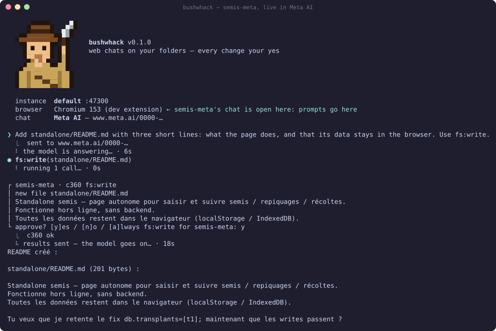
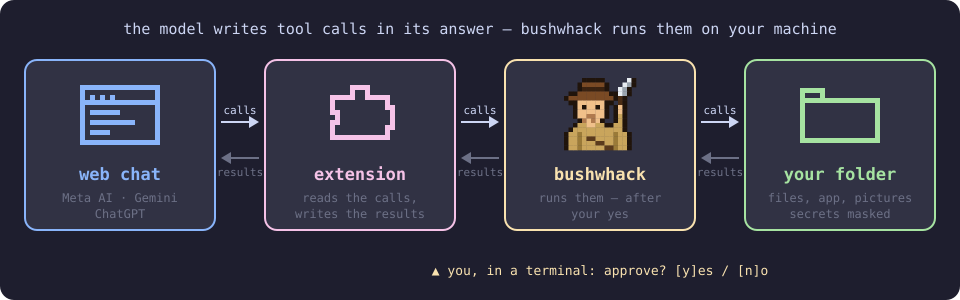

<p align="center"></p>

<h1 align="center">bushwhack</h1>

<p align="center"><b>Let a web chat — Meta AI, Gemini, ChatGPT — work on a folder of your machine.<br>Every change waits for your yes.</b></p>

<p align="center">
  <a href="https://github.com/quazardous/bushwhack-cli/actions/workflows/ci.yml"></a>
  
  
  
</p>

> [!IMPORTANT]
> An independent project, not affiliated with Meta, Google or OpenAI. It drives their web
> chats, whose terms may not allow it, and what the model reads goes to their servers.
> Read the [disclaimer](./DISCLAIMER.md) first.

You ask a chat for a little website, a game, a page of notes… and then you copy its code,
file by file, into your computer. And again at every change.

**bushwhack does the copying.** The chat writes the files itself, in a folder you chose — and
before anything is written, you see what changes and say yes or no. Then it opens the page
it made, looks at it, and fixes what's wrong. You never paste a line of code.

## 🎬 What it looks like

<p align="center"></p>

You type what you want; the chat answers in its web page as usual — and when it wants to
create a file, bushwhack asks you first — in a browser notification, or, as here, in the
terminal (`bushwhack --approve-here`).

## 🧭 How it works

<p align="center"></p>

- 🗣️ **The chat asks** — "write this file", "show me that page": bushwhack teaches it how.
- 🧩 **A browser extension carries the request** from the chat's page to your computer, and
  the answer back.
- 🧑‍⚖️ **You decide** — the chat may look at your folder freely, but every change waits for
  your yes: in a notification, or in the terminal.

## 🚀 Get started

bushwhack runs in a **terminal** — a window where you type commands. It takes five commands
in all, and they are all below: copy, paste, press Enter.

- **Windows:** open the Start menu, type `PowerShell`, open it.
- **Linux:** open the *Terminal* application.

You need:

- **Node.js 22 or later** — [nodejs.org](https://nodejs.org), the *LTS* version. Check with
  `node -v` in a terminal.
- **Chrome or Chromium.**
- An account on **meta.ai**, **Gemini** or **ChatGPT**.

### 1️⃣ Install bushwhack

[**Download the ZIP**](https://github.com/quazardous/bushwhack-cli/archive/refs/heads/main.zip)
and unzip it somewhere it can stay (your home folder, say). Then, in a terminal, go into
that folder and run the installer:

```sh
# Windows (PowerShell)
cd ~\bushwhack-cli-main
powershell -ExecutionPolicy Bypass -File .\setup.ps1
```

```sh
# Linux
cd ~/bushwhack-cli-main
./setup.sh
```

It takes a minute or two. If it ends by saying a folder "is not on your PATH", copy the line
it shows, paste it, press Enter, then close the terminal and open a new one.

(Using git? `git clone https://github.com/quazardous/bushwhack-cli` works just as well.)

bushwhack also gets an icon of its own: in the notification area on Windows, in the top bar
on GNOME (after you log out and back in). 🎒

### 2️⃣ Add the extension to your browser

1. Go to `chrome://extensions` (type it in the address bar).
2. Turn on **Developer mode**, top right.
3. Click **Load unpacked** and pick the `extension/dist` folder, inside the one you unzipped.
4. Pin the bushwhack icon (the puzzle piece → 📌) so it stays in sight.

### 3️⃣ Share a folder

Make a folder for your project, go into it and start bushwhack:

```sh
mkdir ~/my-site
cd ~/my-site
bushwhack
```

bushwhack asks if you want to share this folder: answer `y`. It then shows a **pairing
code** (like `ABCD-EFGH-IJKL`) — keep this terminal open, it's where you'll talk to the chat.

> [!WARNING]
> Everything in the folder may be read by the chat, and so sent to Meta, Google or OpenAI.
> Share a folder made for it, never your whole home folder.

### 4️⃣ Connect a chat

Open a new conversation on meta.ai, Gemini or ChatGPT, then click the bushwhack icon:

1. type the **pairing code** under the service's name, and click **Pair** — once per browser;
2. click **Use for this chat** — this conversation now works on your folder.

> [!WARNING]
> The pairing code goes in the bushwhack panel only — **never in a chat**.

### 5️⃣ Ask, and say yes

Back in the terminal, type what you want and press Enter:

```text
❯ make me a page with my favourite recipes, one card per recipe
```

The chat gets it and gets to work. Each time it wants to create or change a file, **a
notification** pops up — *semis · c12 fs:write — index.html: new file, 40 lines* — with
**Yes** and **No**. Click the notification itself to see everything it will write, and **remember
your answer** — for this file (ticked for you), for every `.js` file, or for all files — so the
next ones like it are not asked. Nothing is written before you answer; the terminal says
where each one stands.

Rather answer in the terminal? Start it with `bushwhack --approve-here`: it shows the change
with what the answer may be remembered for: `y` says yes, `y3` says yes to every `.js`
file from now on.

**See your page:** its address is shown next to `app:` in the terminal, and in the panel —
`http://my-site.localhost:47320/`. Open it in your browser; reload it after each change.

> [!TIP]
> Keep the chat's browser window visible: hidden, the page slows down (Meta AI doesn't even
> load its message box).

## 🧰 What the chat can do

| | |
|---|---|
| 📄 **Files** | read, create, change, move and delete the files of your folder — and nothing outside it |
| 👀 **Its page** | open the page it built, read it, click, fill a form, take a picture of it, see its errors |
| 🖼️ **Pictures** | save a picture it generated into your folder (Meta AI, Gemini) |
| 🔑 **Secrets** | prepare a file for passwords or keys — you type the values, the chat never sees them |
| 🐞 **Bugs** | tell bushwhack's developers when something goes wrong |

Reading your folder happens at once; **every change waits for your yes**.

## 📚 More

- 📖 [The guide](./docs/guide.md) — everything else: several projects, approvals and "always", secrets, pictures, bug reports
- ⌨️ [The command](./docs/cli.md) — every `bushwhack` command and option
- 🩺 [Troubleshooting](./docs/troubleshooting.md) — when it does not work
- 🐙 [octopod mode](./docs/octopod.md) — for developers: a real app with a server and a database, in containers
- 🏗️ [Architecture](./ARCHITECTURE.md) — how it is built, and why
- 🔐 [Security](./SECURITY.md) and the [disclaimer](./DISCLAIMER.md)
- 🤝 [Contributing](./CONTRIBUTING.md) · 📝 [Changelog](./CHANGELOG.md)

## License

MIT — see [LICENSE](./LICENSE).
